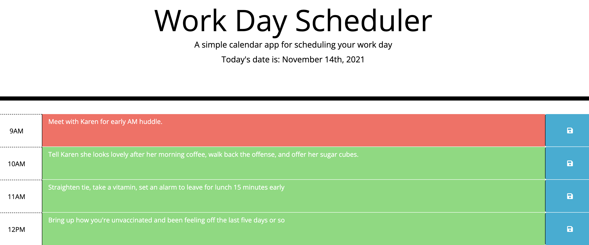

# Workday Scheduler Starter Code

**Version 1.0.0**

## The Purpose
The purpose of this project was to create a planner that would serve as a task manager tool for a prospective employee, student, manager you name it! The idea is one would be able to jot down tasks they have completed, were in the process of, or going to do in the future for any given day. 

## Significant Changes
This project required us to utilize many different aspects of what we learned so far in javascript. I became accustomed with Jquery typescript so you will see many of my DOM manipulation choices were in Jquery. I put a listner on the .saveBtn class that contained the icon and focused on making sure I could set the content of the textarea in local storage as well as make it persist once it was saved. I went with an architecture leveraging the library moment.js for time functionality. In my loop I compared the military time relative to the id of the timeblock by using jquery to target that part of the dom tree and isolate it. This was a handy way to approach this problem, and I got that idea from a breakout session before Wednesday lecture where a student was using military time to approach how to create if/ else if/ and else conditions in the loop.

### Challenges
The challeneges on this assignment had mostly to do with color-coding the timeblock based on if it was in the past, present, or future. I like to use jquery based script more often than plain vanilla javascript, and in my for each loop I had trouble getting the syntax correct so that it would apply the addClass method to a particular timeblock instead of to all timeblocks. The issue was the jquery was at first targeting a class element in the dom that was not unique (".content-box"), so it would apply the addClass method to all timeblocks. By using the getAttribute method on the item from the forEach loop and then looking for the content-box class specific to the item's id allowed me to particularize the target of the addClass method. 

#### Screenshot

##### Link
https://nahom-assefa.github.io/workday-scheduler-/

###### License and Copyright
© Xander Rapstine, Trilogy Education Services/2U